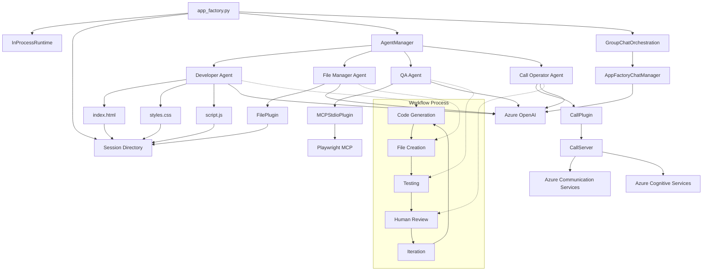

# Semantic Kernel App Factory Demo

A multi-agent demo using Azure AI Foundry Agent Service and Semantic Kernel to build web applications. Playwright MCP is used for interactive testing and Azure Communication Services keeps the human in the loop with phone call integration.

> **Note:** This is a demonstration application designed for learning and experimentation purposes. It is not intended for production use.

## Overview

This application demonstrates a multi-agent system where:
- A **Developer Agent** creates web applications (HTML, CSS, JavaScript)
- A **File Manager Agent** handles file operations
- A **Quality Assurance Agent** tests web applications using Playwright browser automation
- A **Call Plugin** enables phone call automation through Azure Communication Services
- A **Chat Manager** manages the collaboration



## Prerequisites

- Python 3.8 or higher
- Node.js and npm (for Playwright MCP Server)
- Azure subscription
- PowerShell (for Windows users)
- Dev Tunnel CLI tool

## Development Environment Setup

### 1. Clone and Setup Project

```bash
git clone <repository-url>
cd Semantic-Kernel-App-Factory
```

### 2. Create Virtual Environment

```powershell
python -m venv .venv
.venv\Scripts\Activate.ps1
```

### 3. Install Dependencies

```powershell
pip install -r requirements.txt
```

### 4. Install Playwright MCP Server

```powershell
npm install -g @playwright/mcp@latest
```

### 5. Environment Configuration

1. Copy the example environment file:
   ```powershell
   Copy-Item .env.example .env
   ```

2. Edit the `.env` file with your Azure resource details (see Azure Setup section below).

## Azure Services Setup

### 1. Azure AI Foundry Project Setup

1. **Create Azure AI Foundry Project:**
   - Go to [Azure AI Foundry](https://ai.azure.com)
   - Create a new project
   - Note the project endpoint

2. **Deploy Models:**
   - Deploy `gpt-4o-nano` for the AI Agents (or any model supported by the Foundry Agent Service)
   - (Optional) Deploy another model for the agent manager
   - Note the deployment names

3. **Configure Environment Variables:**
   ```
   AZURE_AI_AGENT_ENDPOINT = "https://<resource-name>.services.ai.azure.com/api/projects/<project-name>"
   AZURE_AI_AGENT_MODEL_DEPLOYMENT_NAME = "<your-model-deployment-name-for-agents>"
   AZURE_OPENAI_ENDPOINT = "https://<resource-name>.cognitiveservices.azure.com/"
   AZURE_OPENAI_API_KEY = "<your-api-key>"
   AZURE_OPENAI_CHAT_DEPLOYMENT_NAME = "<your-model-deployment-name-for-chat-management"
   COGNITIVE_SERVICES_ENDPOINT=https://<resource-name>.cognitiveservices.azure.com/
   ```
   - You can use the same Foundry resource for all three endpoints

### 2. Azure Communication Services Setup

1. **Create ACS Resource:**
   - In Azure Portal, create an "Azure Communication Services" resource
   - Note the connection string from the Keys section

2. **Get Phone Number:**
   - Follow the guide: [Get and manage phone numbers in Azure Communication Services](https://learn.microsoft.com/en-us/azure/communication-services/quickstarts/telephony/get-phone-number?tabs=windows&pivots=platform-azp-new)
   - Note the phone number for your environment configuration

3. **Configure Environment Variables:**
   ```
   ACS_CONNECTION_STRING=endpoint=https://<resource-name>.<geo>.communication.azure.com/;accesskey=<your-access-key>
   ACS_PHONE_NUMBER=<your-acs-phone-number>
   TARGET_PHONE_NUMBER=<your-target-phone-number>
   ```

### 2. Azure Communication Services Setup

### 3. Connect Azure Communication Services with Azure AI Services

Follow the official Microsoft documentation for integrating ACS with Azure Cognitive Services:
[Azure Communication Services and Azure Cognitive Services Integration](https://learn.microsoft.com/en-us/azure/communication-services/concepts/call-automation/azure-communication-services-azure-cognitive-services-integration)

This integration enables:
- Speech-to-text conversion during calls
- AI-powered call automation
- Text-to-speech for AI responses

### 4. Dev Tunnel Setup

1. **Install Dev Tunnel CLI:**
   ```powershell
   winget install Microsoft.DevTunnels-CLI
   ```

2. **Configure Tunnel:**
   ```
   DEV_TUNNEL_NAME = "<your-tunnel-name>"
   DEV_TUNNEL_PORT = "8080"
   ```

## Running the Application

### Option 1: Using PowerShell Script (Recommended)

```powershell
.\run.ps1
```

This script will:
- Set up the dev tunnel
- Start the Flask server for call automation
- Start the main app factory application

### Option 2: Manual Setup

1. **Activate Virtual Environment:**
   ```powershell
   .venv\Scripts\Activate.ps1
   ```

2. **Start Dev Tunnel:**
   ```powershell
   devtunnel host --tunnel-name <your-tunnel-name> --port <your-port>
   ```

3. **Start Call Server:**
   ```powershell
   python call_server.py
   ```

4. **Start App Factory:**
   ```powershell
   python app_factory.py
   ```

## Project Structure

```
├── app_factory.py              # Main application entry point
├── app_factory_chat_manager.py # Chat management for agents
├── call_server.py             # Flask server for call automation
├── requirements.txt           # Python dependencies
├── run.ps1                   # PowerShell setup script
├── .env.example              # Environment variables template
├── plugins/                  # Agent plugins
│   ├── call_plugin.py       # Phone call automation
│   └── file_plugin.py       # File operations
└── sessions/                 # Generated web applications
    └── <timestamp>/          # Session-specific outputs
        ├── index.html
        ├── script.js
        └── styles.css
```

## Usage

1. **Start the Application:** Run `.\run.ps1` or follow manual setup steps
2. **Observe the Agents:** The system will create AI agents and task them to build a web application
3. **Phone Integration:** The agents will call you for approval when they are done
4. **View Results:** Generated web applications will be saved in the `sessions/` directory

### Documentation

For details on the components used, refer to:
- [Azure Communication Services Documentation](https://docs.microsoft.com/en-us/azure/communication-services/)
- [Azure AI Foundry Documentation](https://docs.microsoft.com/en-us/azure/ai-studio/)
- [Semantic Kernel Documentation](https://learn.microsoft.com/en-us/semantic-kernel/)

---

> **Generated with GitHub Copilot:** This README and portions of the code were generated with assistance from GitHub Copilot. While we strive for accuracy, inaccuracies may occur. Contributions and pull requests are welcome to improve this project.
